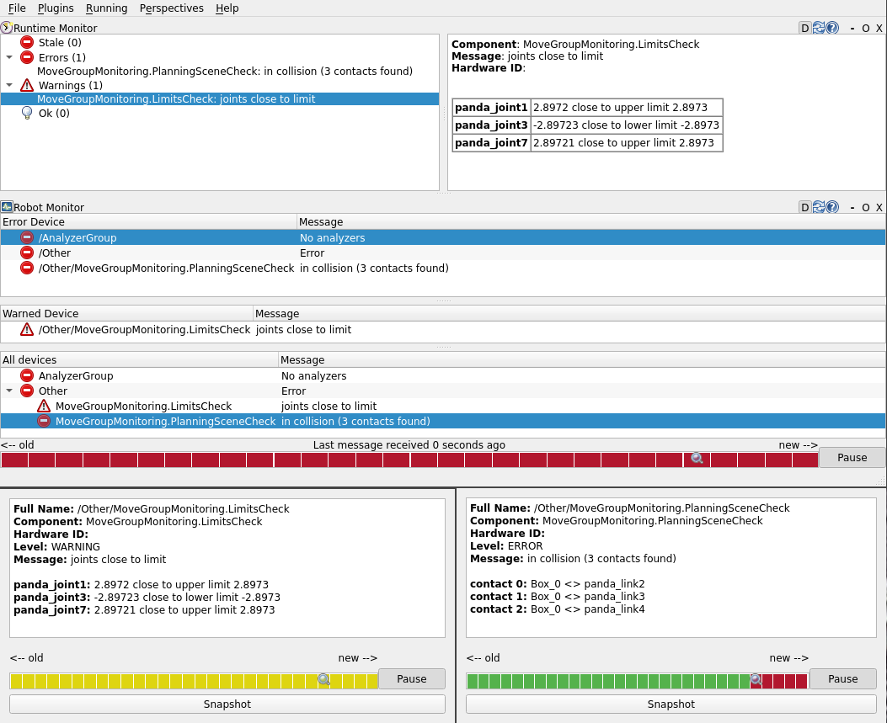

# moveit_monitoring



# install for use

The capability provided by this package has to be loaded as a MoveGroupCapability in your robot's moveit_config.

To do so, either pass the capability as an `arg` to your `move_group.launch`, e.g.,
```
roslaunch myrobot_moveit_config move_group.launch capabilities:=moveit_monitoring/Monitoring
```

or add it to the list of capabilities to load directly in the `move_group.launch`:
```
  <arg name="capabilities" value="
                moveit_monitoring/Monitoring
                " />
```
